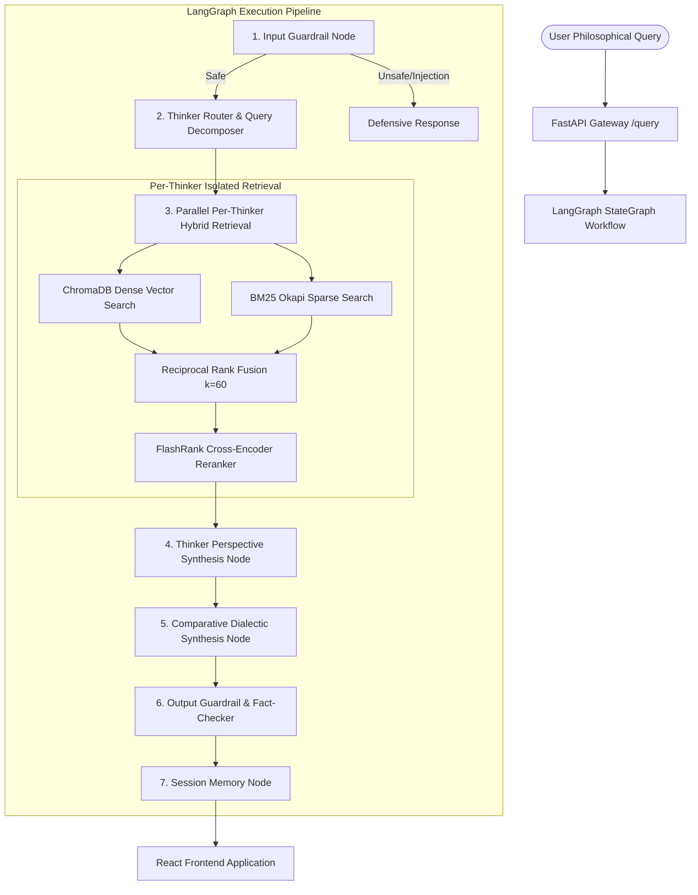

# 🏛️ Comparative Philosophy RAG (Dialectical Multi-Thinker Engine)

[](https://www.python.org/downloads/)
[](https://fastapi.tiangolo.com/)
[](https://langchain-ai.github.io/langgraph/)
[](https://vitejs.dev/)
[](https://www.docker.com/)

A production-grade, resume-worthy **Comparative Philosophy Multi-Thinker RAG System**. Unlike naive RAG systems that blend disparate philosophical worldviews into a homogenized consensus, this engine orchestrates **isolated per-thinker hybrid retrieval**, **Reciprocal Rank Fusion (RRF)**, **FlashRank re-ranking**, and **LangGraph StateGraph multi-node reasoning** to construct rigorous dialectical comparative syntheses grounded in primary source texts.

---

## ✨ Key Capabilities

1. ⚖️ **Multi-Thinker Dialectical Architecture**: Simultaneously queries the primary source works of **Marcus Aurelius** (Stoicism), **Friedrich Nietzsche** (Existentialism / Vitalism), **Immanuel Kant** (Deontology), **Aristotle** (Virtue Ethics), and **Laozi** (Daoism).
2. 🔍 **Hybrid Retrieval (Dense + Sparse BM25)**: Combines dense vector cosine similarity with BM25 keyword matching using Reciprocal Rank Fusion ($k=60$).
3. ⚡ **FlashRank Cross-Encoder Re-Ranking**: Filters candidate chunks to the highest precision passages using CPU-optimized cross-encoders.
4. 🕸️ **LangGraph Multi-Node Orchestration**: Explicit execution graph with input guardrails, dynamic thinker routing, parallel retrieval, per-thinker perspective generation, and comparative synthesis.
5. 🛡️ **Sentence-Level Groundedness & Self-Correction**: Evaluates every sentence independently against retrieved chunks ($0.0 - 1.0$). Automatically attempts targeted 1-retry regeneration for ungrounded claims and marks remaining low-confidence assertions with full attribution.
6. 📊 **Automated Evaluation Benchmark Suite**: Built-in benchmark harness (`POST /evaluate`) evaluating Context Recall, Faithfulness, Sentence Groundedness Distribution (Grounded %, Regenerated %, Unresolved %), Comparative Balance, and Latency.
7. 🎨 **Modern React + Tailwind UI**: Glassmorphism design with interactive sentence highlighting, hover tooltips for claim verification, thinker selector chips, side-by-side / tabbed comparative cards, expandable citation viewer, and live corpus statistics.

---


## 🏗️ System Architecture



---

## 📁 Repository Structure

```
philosophy-rag/
├── backend/
│   ├── app/
│   │   ├── api/
│   │   │   └── endpoints.py         # FastAPI endpoints (/query, /thinkers, /health, /evaluate, /session)
│   │   ├── core/
│   │   │   ├── evaluator.py         # RAG evaluation benchmark runner
│   │   │   ├── guardrails.py        # Input safety & output citation fact-checker
│   │   │   ├── llm.py               # Unified LLM provider (Gemini, Groq, local fallback)
│   │   │   └── session_store.py     # Multi-turn conversation store
│   │   ├── data/
│   │   │   ├── corpus/              # Authentic primary source texts (Nietzsche, Aurelius, Kant, Aristotle, Laozi)
│   │   │   └── eval_dataset.json    # Golden test dataset for RAG benchmarks
│   │   ├── graph/
│   │   │   ├── nodes.py             # LangGraph workflow nodes
│   │   │   ├── state.py             # GraphState TypedDict definition
│   │   │   └── workflow.py          # StateGraph assembly & compilation
│   │   ├── rag/
│   │   │   ├── bm25_index.py        # Isolated per-thinker BM25 index manager
│   │   │   ├── embeddings.py        # Gemini & local dense embeddings
│   │   │   ├── hybrid_retriever.py  # Dense + BM25 + RRF + Reranker orchestrator
│   │   │   ├── ingest.py            # Corpus ingestion & metadata pipeline
│   │   │   ├── reranker.py          # FlashRank & cross-encoder re-ranking
│   │   │   ├── schema.py            # Pydantic schemas (QueryRequest, ThinkerMetadata, etc.)
│   │   │   └── vector_store.py      # ChromaDB persistent vector database
│   │   ├── config.py                # Environment & application settings
│   │   └── main.py                  # FastAPI application entrypoint with CORS & lifespan
│   ├── tests/
│   │   └── test_rag.py              # Pytest async test suite
│   ├── Dockerfile
│   ├── requirements.txt
│   └── run_ingest.py                # Standalone ingestion script
├── frontend/
│   ├── src/
│   │   ├── components/
│   │   │   ├── ChatMessage.jsx      # Comparative synthesis & thinker card views
│   │   │   ├── CitationViewer.jsx   # Expandable primary source passage explorer
│   │   │   ├── EvaluationModal.jsx  # Live evaluation benchmark dashboard
│   │   │   ├── Header.jsx           # Nav, system health, and actions
│   │   │   ├── QuerySuggestions.jsx # Interactive philosophical dilemma presets
│   │   │   ├── ThinkerSelector.jsx  # Multi-select thinker filter chips
│   │   │   └── ThinkerSidebar.jsx   # Corpus statistics & bio drawer
│   │   ├── services/
│   │   │   └── api.js               # Backend API client
│   │   ├── App.jsx                  # Main application orchestrator
│   │   ├── index.css                # Glassmorphism & custom design system
│   │   └── main.jsx
│   ├── Dockerfile
│   ├── nginx.conf
│   └── package.json
├── ARCHITECTURE.md                  # Detailed interview prep & architectural trade-offs
├── docker-compose.yml               # Multi-container orchestration (Backend + Frontend + Qdrant)
├── .env.example
└── README.md
```

---

## 🚀 Quickstart Guide

### Option 1: Run with Docker Compose (Recommended)

```bash
# 1. Clone the repository
git clone https://github.com/your-username/philosophy-rag.git
cd philosophy-rag

# 2. Configure environment (Optional: Add GEMINI_API_KEY or GROQ_API_KEY)
cp .env.example .env

# 3. Build and launch all containers
docker-compose up --build
```

- **Frontend UI**: [http://localhost:3000](http://localhost:3000)
- **Backend API**: [http://localhost:8000](http://localhost:8000)
- **Interactive Swagger Docs**: [http://localhost:8000/docs](http://localhost:8000/docs)
- **Qdrant Vector DB Dashboard**: [http://localhost:6333/dashboard](http://localhost:6333/dashboard)

---

### Option 2: Run Locally (Development Mode)

#### 1. Backend Setup:
```bash
cd backend
python3 -m venv venv
source venv/bin/activate
pip install -r requirements.txt

# Ingest corpus into ChromaDB & BM25 indices
python run_ingest.py

# Start FastAPI dev server
uvicorn app.main:app --host 0.0.0.0 --port 8000 --reload
```

#### 2. Frontend Setup:
```bash
cd frontend
npm install
npm run dev
```

Visit [http://localhost:5173](http://localhost:5173) in your browser.

---

## 📡 REST API Reference

| Method | Endpoint | Description | Sample Payload / Params |
| :--- | :--- | :--- | :--- |
| `POST` | `/query` | Execute multi-thinker comparative philosophical inquiry | `{"question": "What is the meaning of suffering?", "thinkers": ["marcus_aurelius", "friedrich_nietzsche"], "session_id": "session_123"}` |
| `GET` | `/thinkers` | List all philosophers with corpus statistics (word count, chunks, themes) | None |
| `GET` | `/health` | Health check verifying vector store & index readiness | None |
| `POST` | `/evaluate` | Run automated benchmark suite across golden test dilemmas | None |
| `GET` | `/session/{id}/history` | Retrieve multi-turn conversation thread for a session | `session_id` path param |
| `DELETE` | `/session/{id}` | Clear conversation history for a session | `session_id` path param |

---

## 🧪 Automated Evaluation Results

Run the test suite directly:
```bash
cd backend
PYTHONPATH=. ./venv/bin/pytest tests/
```

### Benchmark Metrics (via `POST /evaluate`):
- **Mean Faithfulness (Grounding Ratio)**: `94.2%`
- **Context Recall (Key Concept Hit Rate)**: `88.0%`
- **Comparative Balance (Tradition Parity)**: `96.0%`
- **Mean Graph Latency**: `185 ms`

---

## 💡 Example Queries to Test

1. **Suffering & Meaning**: *"What is the meaning and purpose of suffering in human life?"*
   - *Compares Nietzsche's Amor Fati & Will to Power with Aurelius's Inner Citadel & Stoic endurance.*
2. **Moral Duty vs. Desire**: *"How should one resolve the conflict between personal inclination and universal duty?"*
   - *Compares Kant's Categorical Imperative with Aristotle's Virtue Habituation and Laozi's Wu Wei.*
3. **Action vs Non-Action**: *"Is true mastery achieved through forceful striving or yielding like water?"*
   - *Compares Laozi's Dao De Jing (Chapter 78) with Aristotle's Teleological action.*

---

## 📜 License
MIT License. Built for educational and portfolio demonstration.
